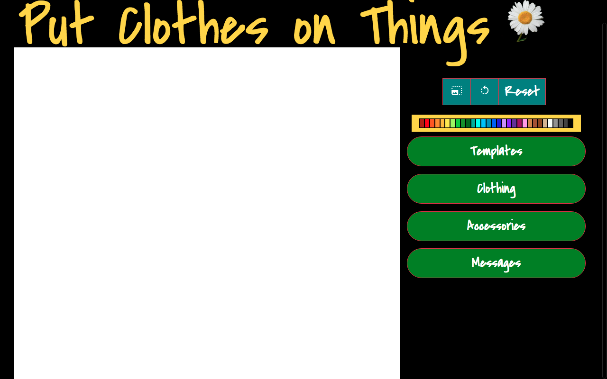
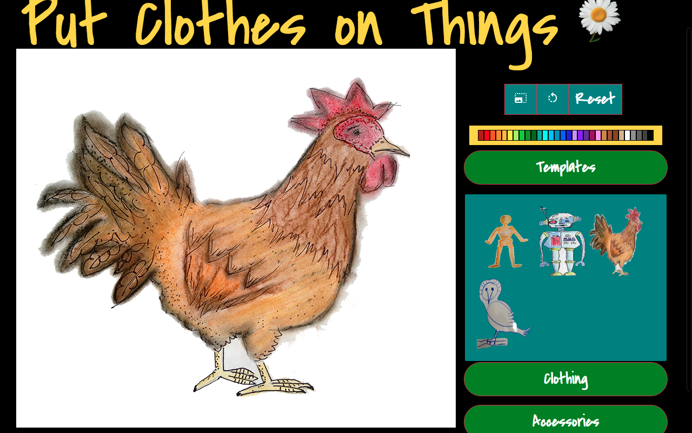
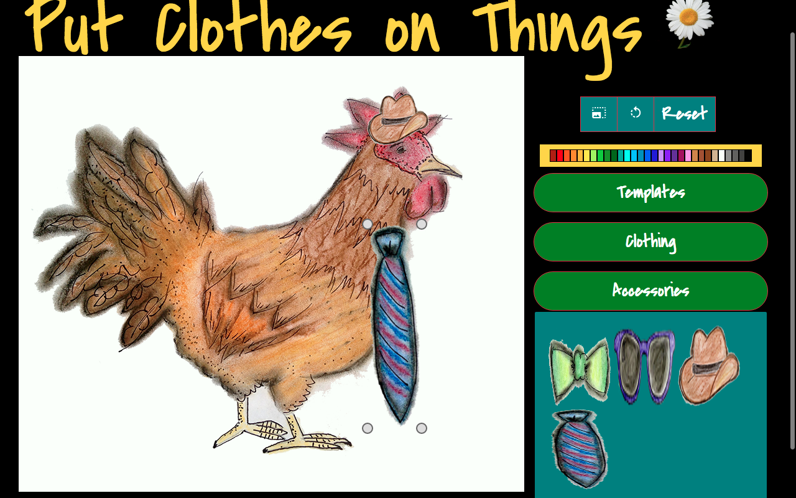
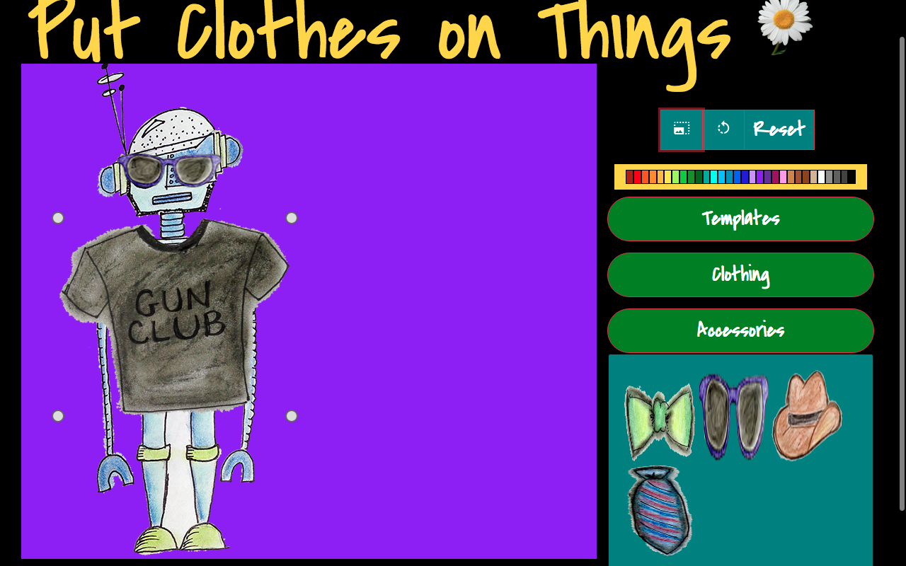

# Put Clothes on Things

**Sending artwork and smiles to friends and loved ones!**
 

Put Clothes on Things is a front-end application that allows users to dress various image templates with clothing and accessories, providing a creative way to spend time by sending electronic greetings to friends.

## Features

1. Render Templates

 

2. Render Clothing and Accessories

3. Resize your image

4. Email your artwork to your friends!

## Technologies

* Javascript
* HTML
* Node
* HTML5 Canvas
* **[Konva.js](https://konvajs.github.io)** - Canvas library
* **[Bootstrap](https://getbootstrap.com/)** - styling agent

## Challenges

* Teaching myself Konva and Bootstrap. So much time was taken to learn and integrate these libraries, but I learned that research is essential for any project.

* Finding the right image API. I could only find image APIs that stored images, not provided images for use. Instead, I drew all of the images myself.

* Refactoring the logic for resizing so it was more dynamic. This was a great experience in learning high-order and single responsibility functions. There were many details to keep track of!

### Wanna send some art to your friends?
Check out the app [here](https://jaymeramsay.github.io/Q1project/)
